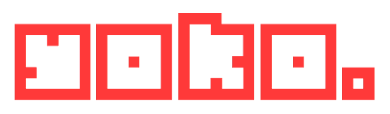

**Yoko** is a small framework to make games with ruby. Yoko use mruby to allow your game be compiled for different platforms.

It is inspired by other frameworks like [LÖVE](http://www.love2d.org) but following another ideas and patterns.

# Warning

Yoko is in a very early stage of development (let's say that it's an alpha version) so we can't ensure that API will not change in the future.

# Examples

A simple example of how to show a rotating square on screen is the following:

```ruby
square = nil

config do |conf|
  conf.window.title = 'Rotating Square Example'
  conf.window.width = 800
  conf.window.height = 600
  conf.window.fullscreen = :exclusive # :desktop, :exclusive or :windowed (default)
end

load do
  square = load_sprite('my_square_image.png')
  square.x, square.y = 50, 50
end

update do
  square.angle += 2.0

  quit if key_pressed? :escape
end

draw do
  square.draw
end

quit do
  puts 'Closing our rotating square example!'
end

Yoko.loop
```

# Install

## Dependencies

First you need to have installed some Yoko dependencies:

- SDL2
- SDL2_Image

You can easily install them with brew (on MacOS):

```sh
$ brew install sdl2 sdl2_image
```

or with apt-get (on Debian-based distributions):

```
# apt-get install libsdl2-dev libsdl2-image-dev
```

## Compilation

After install dependencies you can compile yoko:

```sh
$ make
```

This will create some files under the `bin` directory, `yoko` interpreter and the interactive shell `iyoko`.

You can execute your game with `yoko`:

```sh
$ cd bin
$ ./yoko game.rb
```

# API

TODO
